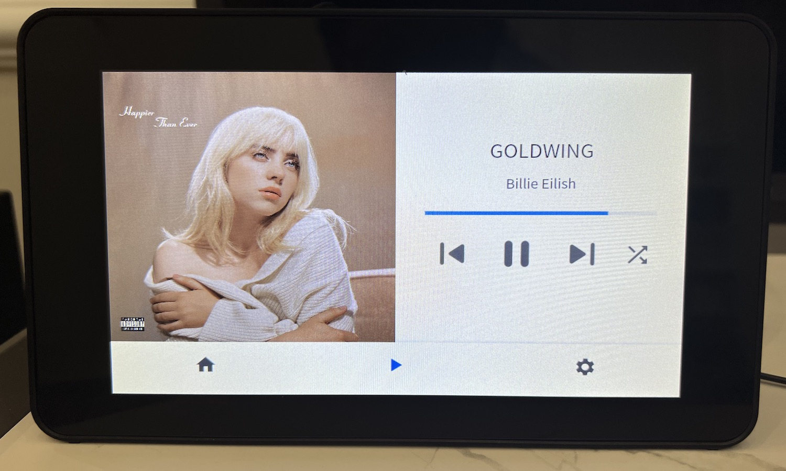

[EN](READM.md) | 中文

# Touch Display Lite - Volumio 3简约触控界面

Feng Zhou, 2021-12

touch Display Lite是一个[Volumio 3](https://volumio.com/)（Linux数播）的简单的触控界面。我写来在树莓派+官方7寸触屏上播放音乐用（理论上也可以支持其它屏）。7寸大小的屏幕在这个场景下其实很合适，但可惜Volumio官方的界面在这个屏幕上不太好用，所以不如自己动手写一个。

最终结果长这样：



特点：
 * 为横屏播放优化，这是写这个东西的主要原因。Volumio官方界面主要是为竖屏设计的，横屏的时候界面很拥挤，专辑封面显示也非常小。
 * 即使在老旧的Raspberry Pi 3性能也不错。
 * 和手机App类似的触控体验。底层是flutter-pi，没有使用古老的X-Window。

限制：
 * 目前功能比较简单，就是播放曲库中的音乐，没有流媒体等功能。

## 使用说明
 
Touch Display Lite是Volumio 3的一个插件，主要考虑RPi 3/4与官方7寸触屏的使用。如果你已经在Pi上装好了Volumio 3，
就可以这样安装Touch Display Lite：

 1. 打开SSH访问：在[volumio.local/dev](http://volumio.local/dev)上面可以操作。
 2. 取得`touch_display_lite.zip`，通过ssh上传到Pi上，用`miniunzip`解压缩。
 3. 在解压缩目录中，`volumio plugin install`，这个需要5-10分钟。
 4. 安装中文字体：`sudo apt install -y fonts-noto-cjk`
 5. **重启**，装截视频驱动和将屏幕转180度。如果你要其它角度，修改`/boot/config.txt`里面的`lcd_rotate`。
 6. 在Web页面上打开Touch Display Lite插件，Pi的显示将进入本文开头照片的界面。

## 编译DigiPlayer

如果需要从头编译，你需要：

 * 树莓派3或4.
 * [7寸官方触屏](https://www.raspberrypi.com/products/raspberry-pi-touch-display/)。我还用了[外壳](https://www.amazon.com/Raspberry-Pi-7-Inch-Touch-Screen/dp/B01GQFUWIC)。
 * 开发计算机 (Windows/Mac/Linux)
 * 需要一台Linux x64计算机或虚拟机，用来编译Flutter的app.so

看一眼[flutter engine binaries](https://github.com/ardera/flutter-engine-binaries-for-arm)页面，看下目前树莓派上Flutter引擎支持最新的版本是多少，写这个文档时是2.5.3.

去Flutter主页下载并安装相应版本的[Flutter](https://docs.flutter.dev/development/tools/sdk/releases)，这有1多个G，可以用中国镜像.

在Linux计算机或虚拟机上，下载[flutter engine binaries](https://github.com/ardera/flutter-engine-binaries-for-arm)：
```
mkdir -p work/flutter
cd work/flutter
git clone https://github.com/ardera/flutter-engine-binaries-for-arm
```

下面就可以在开发机上正式编译DigiPlayer了：
```
cd digiplayer

# 看下build_release.sh开头，检查下文件位置都对不对
# 这个脚本干的事情，是在本地编译flutter bundle，然后ssh登录到Linux机器上去编译app.so，再传回本机。
# 再看下lib/main.dart开头的几个设置：serverAddr (Pi的地址，volumio.local应该可以), defaultDir（默认音乐文件路径）.
./build_release.sh

# 如果编译成功, 结果文件在：build/flutter_assets中，包括app.so，这个是主要的二进制代码
```

在树莓派上安装好[Volumio 3](https://volumio.lpages.co/volumio-3/) （下载zip，解压，刷到SD卡上就可以了）。然后按照[flutter-pi page](https://github.com/ardera/flutter-pi) 上的说明在Pi上安装flutter-pi（似乎这东西缺个中文安装说明）。flutter-pi是树莓派上的轻量级Flutter运行环境，不需要X Window就可以运行。

现在终于可以上传DigiPlayer到Pi上运行了：
```
rsync -av build/flutter_assets/* volumio@volumio.local:digiplayer/
ssh volumio@volumio.local
flutter-pi --release digiplayer
```

应该可以看到文件头图那样的界面。

如果需要，可以在设备启动时自动运行DigiPlayer。这可以通过`sudo nano /etc/rc.local`修改这个启动文件来实现，在最后增加：
```
runuser -l volumio -c "/usr/local/bin/flutter-pi /home/volumio/digiplayer" &
```

## Volumio有什么好处?

这样的一个组合我觉得还挺好用的，原因包括：

 * **灵活的网络播放**，我主要是把音乐文件放在NAS上面，然后通过客厅的带屏树莓派播放就很方便。
 * **数字无损输出**，我加了一个数字输出的扩展板（[Teradak I2S](https://item.taobao.com/item.htm?spm=a1z09.2.0.0.14fc2e8d0yaAi8&id=596093222906&_u=b2m28ph86a8)，一百多块），声音质量不错。然后为了美观还3D打印了一个[后盖](tools/case/case_side.jpg) ([OpenSCAD源代码](tools/case/))。
 * **手机遥控很好用**，用手机浏览器访问volumio.local就可以了，浏览、播放功能都很方便，这样在沙发上就可以操作音乐播放。屏上的显示也都是同步的。在iPhone上还可以把这个网页加到手机首页（Safari中`分享->添加一到主屏幕`），这样体验更好，和App基本分不出来。
 * Volumio还有一堆功能没时间看，总体还是挺成熟的了。